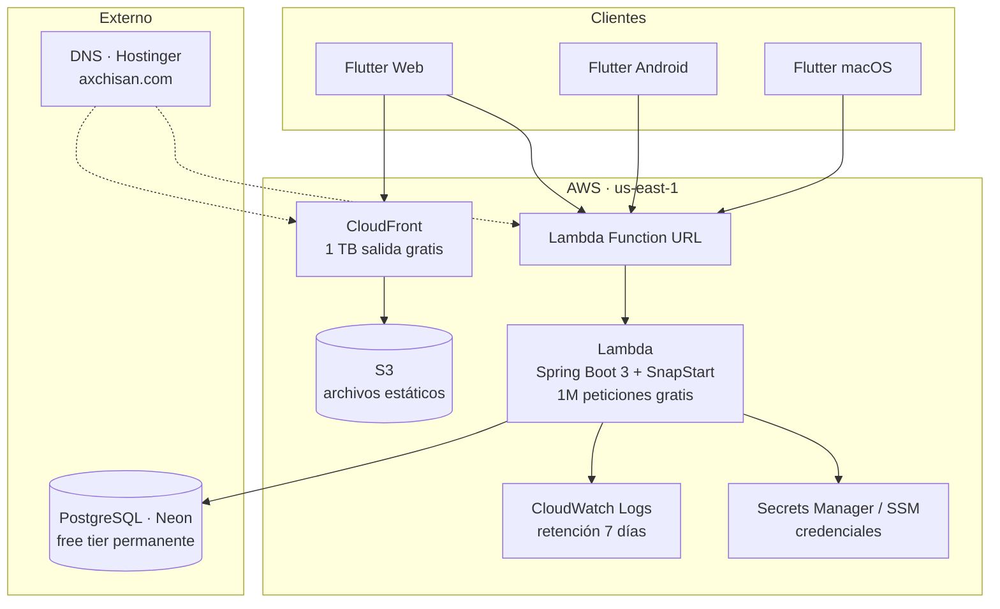
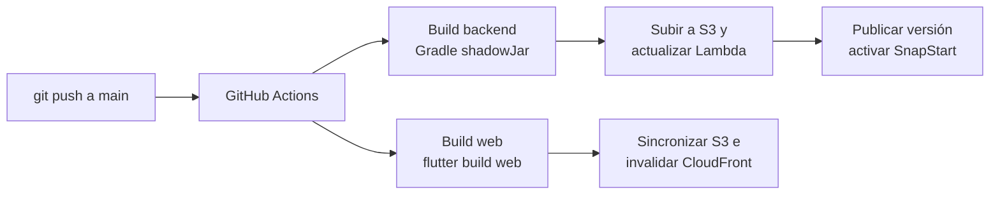

# Arquitectura

## Visión general

Aplicación de finanzas personales con cliente multiplataforma y una API REST sin servidor.
El diseño prioriza **costo operativo cercano a cero de forma permanente** sobre la
simplicidad operativa, porque la cuenta de AWS asociada no tiene el free tier clásico de 12
meses (fue creada en junio de 2026, bajo el modelo de créditos).

## Dominios

| Subdominio | Apunta a | Propósito |
|---|---|---|
| `gastos.axchisan.com` | CloudFront | Aplicación web |
| `api.axchisan.com` | Lambda Function URL (vía CloudFront) | API REST |

El DNS permanece en **Hostinger** (sin costo). Los certificados TLS los emite **ACM**
(gratis) y se validan con registros CNAME creados manualmente en el panel de Hostinger.

> Se descarta Route 53 porque cobra $0.50/mes por zona alojada sin aportar nada en este
> escenario.

## Componentes

### Cliente — Flutter

Un único código base compilado a tres objetivos.

| Capa | Responsabilidad |
|---|---|
| `presentation/` | Pantallas y widgets |
| `application/` | Estado y casos de uso (Riverpod) |
| `domain/` | Entidades y reglas de negocio puras |
| `infrastructure/` | Cliente HTTP (Dio), almacenamiento local (Drift/Isar) |

**Modo offline**: los datos del mes se cachean localmente para poder consultarlos sin
conexión y sincronizarlos al recuperarla. Esto además enmascara el cold start de Lambda.

**El motor de cálculo vive en `domain/`** y se ejecuta en el cliente para que las gráficas y
totales respondan instantáneamente mientras se editan valores. El backend recalcula y valida
antes de persistir, para que el servidor sea siempre la fuente de verdad.

### API — Spring Boot 3 en Lambda

Se usa `aws-serverless-java-container-springboot3`, que adapta las peticiones HTTP de Lambda
al `DispatcherServlet` de Spring. El código de la aplicación es Spring Boot convencional:
`@RestController`, `@Service`, JPA, Spring Security.

**SnapStart** toma un snapshot del proceso ya inicializado tras el arranque, bajando el cold
start de 5-15 s a unos 200-500 ms. No tiene costo adicional en runtimes de Java.

Empaquetado como **ZIP** (fat JAR de ~40 MB), no como imagen de contenedor: ECR solo tiene
free tier durante 12 meses, del que esta cuenta no dispone.

### Base de datos — PostgreSQL en Neon

PostgreSQL relacional con JPA/Hibernate y migraciones versionadas con **Flyway**.

Al estar **fuera de la VPC**, Lambda no necesita interfaces de red en VPC, lo que evita el
**NAT Gateway (~$32/mes)** — el costo oculto que suele arruinar estas arquitecturas.

**Pool de conexiones**: Lambda puede abrir muchas conexiones concurrentes y agotar el límite
de PostgreSQL. Se usa el endpoint con *pooler* (PgBouncer) de Neon y un pool de HikariCP
reducido (`maximum-pool-size: 2`), acorde al modelo de concurrencia de Lambda.

### Autenticación

JWT propio sobre Spring Security:

- **Access token**: 15 minutos, firmado HS256, transportado en `Authorization: Bearer`.
- **Refresh token**: 30 días, rotativo, almacenado hasheado en base de datos para poder
  revocarlo.
- **Contraseñas**: BCrypt con factor de coste 12.
- El secreto de firma se guarda en **SSM Parameter Store** (tier estándar, gratis).

## Flujo de despliegue

Las credenciales de AWS en CI se resuelven con **OIDC** (rol asumible desde GitHub), sin
guardar claves de acceso estáticas en los secretos del repositorio.

## Decisiones descartadas

| Alternativa | Motivo del descarte |
|---|---|
| EC2 t4g.small + Docker | ~$16.70/mes desde enero-2027 (instancia + IPv4 + disco) |
| RDS PostgreSQL | ~$12/mes desde el primer día; sin free tier en esta cuenta |
| DynamoDB | NoSQL; complica reportes y agregaciones financieras |
| Aurora Serverless v2 | Cobra almacenamiento aun pausado; ~15 s para despertar |
| API Gateway | Function URL cubre el caso sin costo por petición |
| AWS Cognito | Infraestructura extra innecesaria para una app personal |
| Route 53 | $0.50/mes sin beneficio frente al DNS de Hostinger |

Cada decisión relevante está registrada en [`adr/`](adr/).

## Riesgos conocidos

| Riesgo | Mitigación |
|---|---|
| Neon cambia su free tier | El esquema es PostgreSQL estándar; migrar a otro proveedor o a RDS es un `pg_dump`/`pg_restore` |
| Cold start perceptible | SnapStart + caché local en el cliente |
| Agotamiento de conexiones | Endpoint con pooler + HikariCP limitado a 2 |
| Costo inesperado en AWS | Alerta de presupuesto a $1/mes y retención de logs de 7 días |
| Pérdida de datos | Respaldo automático de Neon + volcado periódico a S3 |
