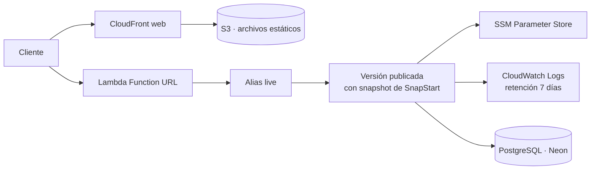

# Despliegue en AWS

Cuenta `612216903994` · región `us-east-1` · infraestructura en [`infra/terraform`](../infra/terraform)

**API en producción**:
`https://o2oiatmxp6ihxxzz3hlwt67kcu0nfvih.lambda-url.us-east-1.on.aws/`

| Medición | Valor |
|---|---|
| Arranque en frío (SnapStart) | ~1,6 s, del que 855 ms son la restauración |
| Duración facturada por la restauración | 14 ms |
| Petición en caliente | ~250 ms |
| Memoria usada | 478 MB de 1024 MB |

## Qué se despliega



| Recurso | Para qué |
|---|---|
| Lambda `calculadora-gastos-api` | La API, en Java 21 sobre arm64 con SnapStart |
| Alias `live` | Punto de entrada estable; la URL no cambia al desplegar |
| Function URL | Entrada HTTP sin costo por petición, en lugar de API Gateway |
| S3 `…-artefactos-…` | JAR desplegado, con versiones y purga a los 30 días |
| S3 `…-web-…` | Aplicación web; privado, solo accesible vía CloudFront |
| CloudFront | CDN de la web, con 1 TB de salida gratis al mes |
| SSM Parameter Store | Credenciales, como `SecureString` |
| CloudWatch Logs | Registros, con caducidad a 7 días |
| Presupuesto y alarmas | Aviso por correo si el gasto o los errores se disparan |

## Decisiones que conviene conocer

**Arquitectura arm64 (Graviton).** Cuesta menos por GB-segundo que x86 con el mismo
rendimiento en esta carga.

**El alias `live` apunta siempre a una versión publicada.** SnapStart solo genera snapshots de
versiones publicadas, no de `$LATEST`. Publicar una versión es lo que dispara la creación del
snapshot: ahí arranca Spring y se aplican las migraciones de Flyway. Si algo falla, la versión
no llega a publicarse y el alias sigue sirviendo la anterior.

**Las credenciales no están en Terraform.** Los parámetros de SSM se crean con el CLI, no con
Terraform, porque el estado de Terraform guarda en claro todo lo que gestiona. Terraform solo
concede a la función permiso de lectura sobre `/calculadora-gastos/*`.

**El paquete no es un uber-jar.** La tarea `paqueteLambda` genera un ZIP con las clases en la
raíz y las dependencias como JAR separados en `lib/`. Fusionarlo todo en un único JAR rompe
Spring: los descriptores de autoconfiguración bajo `META-INF` existen con el mismo nombre en
decenas de artefactos y se sobrescriben entre sí, dejando a Spring Data sin registrar los
repositorios. El síntoma es un fallo al arrancar del tipo `No qualifying bean of type …`.

**CloudFront delante de la API solo aporta el dominio.** Las Function URL no admiten nombres
personalizados. Mientras no se active `usar_dominio_propio`, la API se usa directamente por su
URL de AWS y no hay distribución para ella.

**Una Function URL pública necesita dos permisos, no uno.** Desde octubre de 2025, AWS exige
que la política conceda tanto `lambda:InvokeFunctionUrl` como `lambda:InvokeFunction`. Con solo
el primero, cada petición responde `403 AccessDeniedException` sin indicar qué falta, y la
mayoría de ejemplos publicados son anteriores al cambio y solo muestran uno. Ambos están
declarados en `lambda.tf`.

## Primer despliegue

```bash
# 1. Parámetros con las credenciales (una sola vez)
set -a && source .env.neon && set +a
P=/calculadora-gastos
aws ssm put-parameter --name "$P/spring.datasource.url"      --value "$DB_URL"      --type SecureString --overwrite
aws ssm put-parameter --name "$P/spring.datasource.username" --value "$DB_USER"     --type SecureString --overwrite
aws ssm put-parameter --name "$P/spring.datasource.password" --value "$DB_PASSWORD" --type SecureString --overwrite
aws ssm put-parameter --name "$P/app.jwt.secret"             --value "$JWT_SECRET"  --type SecureString --overwrite
aws ssm put-parameter --name "$P/app.cors.allowed-origins"   --value "https://gastos.axchisan.com,http://localhost:*" --type String --overwrite
aws ssm put-parameter --name "$P/app.seguridad.bcrypt-coste" --value "12"           --type String --overwrite

# 2. Artefacto
cd backend && ./gradlew shadowJar

# 3. Infraestructura
cd ../infra/terraform
terraform init
terraform apply
```

## Activar los dominios propios

El DNS de `axchisan.com` vive en **Hostinger**, así que la validación del certificado no puede
automatizarse. Es un proceso de tres pasos:

```bash
terraform apply -var="usar_dominio_propio=true"
```

El comando se queda esperando la validación. Mientras tanto, en otra terminal:

```bash
terraform output registros_dns_pendientes
```

Devuelve los registros CNAME que hay que **crear a mano en el panel de Hostinger**
(*Dominios → DNS → Añadir registro*). Con ellos creados, ACM valida en unos minutos y el
`apply` continúa por su cuenta.

Después hay que apuntar los subdominios a CloudFront, también en Hostinger:

| Tipo | Nombre | Valor |
|---|---|---|
| CNAME | `gastos` | dominio de la distribución web |
| CNAME | `api` | dominio de la distribución de la API |

Se obtienen con `terraform output`.

> Se usan subdominios y no el dominio raíz porque la mayoría de registradores, Hostinger
> incluido, no admiten CNAME en el ápex. Route 53 lo resolvería con registros ALIAS, pero
> cobra 0,50 USD al mes por zona alojada.

## Despliegue continuo

Dos flujos de trabajo, con filtros por ruta para que un cambio en el cliente no reconstruya el
backend:

| Archivo | Se dispara con | Qué hace |
|---|---|---|
| `.github/workflows/backend.yml` | cambios en `backend/**` | Pruebas contra PostgreSQL, construye, publica versión, mueve el alias y comprueba que responde |
| `.github/workflows/web.yml` | cambios en `app/**` | Formato, análisis, pruebas, compila y publica en S3 con invalidación de CloudFront |

Las credenciales se obtienen por **OIDC**: GitHub recibe credenciales temporales al ejecutarse
y no hay ninguna clave permanente en los secretos del repositorio. El rol está restringido a
este repositorio y a las acciones justas para desplegar.

### Configuración en GitHub

Secreto:

| Nombre | Valor |
|---|---|
| `AWS_ROLE_ARN` | `terraform output rol_despliegue` |

Variables:

| Nombre | Valor |
|---|---|
| `BUCKET_WEB` | `terraform output bucket_web` |
| `DISTRIBUCION_WEB` | `terraform output distribucion_web` |
| `API_URL` | `terraform output url_api` |

## Operación

```bash
# Estado y URL actual
terraform output

# Registros en vivo
aws logs tail /aws/lambda/calculadora-gastos-api --follow

# Comprobar que responde
curl "$(terraform output -raw url_api)api/salud"

# Gasto del mes en curso
aws ce get-cost-and-usage \
  --time-period Start=$(date +%Y-%m-01),End=$(date -v+1m +%Y-%m-01) \
  --granularity MONTHLY --metrics UnblendedCost

# Volver a una versión anterior
aws lambda update-alias --function-name calculadora-gastos-api \
  --name live --function-version <numero>
```

### Rotar credenciales

Al cambiar la contraseña en Neon:

```bash
aws ssm put-parameter --name /calculadora-gastos/spring.datasource.password \
  --value "NUEVA" --type SecureString --overwrite
```

El valor queda capturado en el snapshot de SnapStart, así que **hay que publicar una versión
nueva** para que surta efecto: basta con volver a lanzar el flujo de despliegue.

## Costo

Todo el conjunto vive dentro del nivel gratuito permanente. El único cargo real es el
almacenamiento en S3, de unos **0,005 USD al mes** — ver [COSTOS.md](COSTOS.md).

Protecciones activas:

- Aviso por correo si el gasto del mes supera **1 USD**, y otro si la proyección supera 2 USD.
- Retención de registros a 7 días.
- Alarmas de errores y de duración excesiva.
- Ningún recurso factura por horas: si nadie usa la aplicación, el costo tiende a cero.
