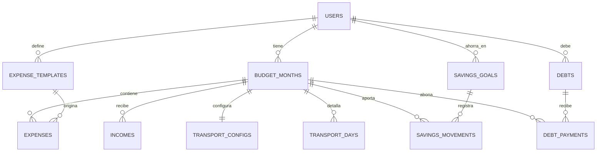

# Modelo de dominio

## Concepto central: el mes presupuestal

Todo gira alrededor del **mes**. Cada mes es una unidad cerrada con su propio sueldo, sus
gastos, su cálculo de transporte y sus aportes al ahorro. Las **plantillas de gastos fijos**
y las **deudas** viven a nivel de usuario y se proyectan sobre cada mes.

Esto permite que el sueldo y cualquier gasto cambien de un mes a otro sin alterar el
histórico, que es imprescindible para las gráficas de evolución.



## Entidades

### `users`

| Campo | Tipo | Notas |
|---|---|---|
| `id` | UUID | PK |
| `email` | text | único |
| `password_hash` | text | BCrypt coste 12 |
| `nombre` | text | |
| `moneda` | text | `COP` por defecto |
| `zona_horaria` | text | `America/Bogota` |
| `created_at` / `updated_at` | timestamptz | |

### `refresh_tokens`

Permite revocar sesiones e implementar rotación de tokens.

| Campo | Tipo | Notas |
|---|---|---|
| `id` | UUID | PK |
| `user_id` | UUID | FK |
| `token_hash` | text | SHA-256; nunca se guarda el token en claro |
| `expires_at` | timestamptz | |
| `revoked_at` | timestamptz | nulo si sigue activo |

### `expense_templates` — plantilla de gastos fijos

Los gastos recurrentes se definen una vez y se copian a cada mes nuevo. Editar la plantilla
**no** modifica los meses ya creados.

| Campo | Tipo | Notas |
|---|---|---|
| `id` | UUID | PK |
| `user_id` | UUID | FK |
| `nombre` | text | «Arriendo y comida», «Celular» |
| `categoria` | enum | ver más abajo |
| `monto_default` | numeric(14,2) | valor sugerido, editable por mes |
| `dia_vencimiento` | int | 1-31, opcional; para recordatorios |
| `activo` | bool | |
| `orden` | int | orden de presentación |

**Categorías**: `VIVIENDA`, `ALIMENTACION`, `TRANSPORTE`, `SERVICIOS`, `SUSCRIPCIONES`,
`SALUD`, `EDUCACION`, `DEPORTE`, `HERRAMIENTAS`, `DEUDA`, `AHORRO`, `OTRO`.

### `budget_months` — el mes

| Campo | Tipo | Notas |
|---|---|---|
| `id` | UUID | PK |
| `user_id` | UUID | FK |
| `anio` | int | |
| `mes` | int | 1-12 |
| `ingreso_base` | numeric(14,2) | sueldo del mes; editable |
| `cerrado` | bool | al cerrarlo se congela para el histórico |
| `notas` | text | |

Restricción única sobre `(user_id, anio, mes)`.

### `incomes` — ingresos adicionales

Para primas, bonos o trabajos extra que no son el sueldo base.

| Campo | Tipo | Notas |
|---|---|---|
| `id` | UUID | PK |
| `budget_month_id` | UUID | FK |
| `concepto` | text | |
| `monto` | numeric(14,2) | |
| `fecha` | date | |
| `recibido` | bool | permite proyectar ingresos aún no cobrados |

### `expenses` — gastos del mes

| Campo | Tipo | Notas |
|---|---|---|
| `id` | UUID | PK |
| `budget_month_id` | UUID | FK |
| `template_id` | UUID | FK nullable; nulo si es un gasto puntual |
| `nombre` | text | |
| `categoria` | enum | |
| `monto` | numeric(14,2) | |
| `monto_pagado` | numeric(14,2) | soporta abonos parciales |
| `estado` | enum | `PENDIENTE` · `PARCIAL` · `PAGADO` |
| `fecha_pago` | date | nulo mientras esté pendiente |
| `dia_vencimiento` | int | |
| `origen` | enum | `MANUAL` · `PLANTILLA` · `TRANSPORTE` · `DEUDA` |
| `notas` | text | |

El campo `origen` distingue los gastos que genera el sistema: el resultado del cálculo de
transporte y los abonos a deudas se reflejan como gastos del mes, pero no son editables
directamente — se modifican desde su módulo correspondiente.

### `debts` — deudas externas

| Campo | Tipo | Notas |
|---|---|---|
| `id` | UUID | PK |
| `user_id` | UUID | FK |
| `acreedor` | text | «Tarjeta Bancolombia», «Papá» |
| `tipo` | enum | `TARJETA_CREDITO` · `PRESTAMO_BANCARIO` · `FAMILIAR` · `AMIGO` · `OTRO` |
| `monto_original` | numeric(14,2) | |
| `saldo` | numeric(14,2) | se recalcula con cada abono |
| `tasa_interes_mensual` | numeric(6,4) | nullable |
| `cuota_sugerida` | numeric(14,2) | nullable |
| `fecha_inicio` | date | |
| `fecha_limite` | date | nullable |
| `activa` | bool | pasa a falso cuando el saldo llega a cero |

### `debt_payments` — abonos

| Campo | Tipo | Notas |
|---|---|---|
| `id` | UUID | PK |
| `debt_id` | UUID | FK |
| `budget_month_id` | UUID | FK nullable; vincula el abono al mes |
| `monto` | numeric(14,2) | |
| `fecha` | date | |
| `nota` | text | |

### `savings_goals` — metas de ahorro y distribución

| Campo | Tipo | Notas |
|---|---|---|
| `id` | UUID | PK |
| `user_id` | UUID | FK |
| `nombre` | text | «Fondo de emergencia», «Viaje» |
| `tipo_asignacion` | enum | `PORCENTAJE_INGRESO` · `MONTO_FIJO` · `PORCENTAJE_SOBRANTE` |
| `valor` | numeric(14,2) | porcentaje o monto según el tipo |
| `meta_monto` | numeric(14,2) | nullable; objetivo total |
| `saldo_acumulado` | numeric(14,2) | |
| `color` | text | para las gráficas |
| `prioridad` | int | orden de asignación del excedente |
| `activa` | bool | |

`PORCENTAJE_SOBRANTE` se aplica sobre lo que queda **después** de gastos y deudas, lo que
permite reglas del tipo «el 50% de lo que sobre va al fondo de emergencia».

### `savings_movements`

| Campo | Tipo | Notas |
|---|---|---|
| `id` | UUID | PK |
| `savings_goal_id` | UUID | FK |
| `budget_month_id` | UUID | FK |
| `tipo` | enum | `APORTE` · `RETIRO` |
| `monto` | numeric(14,2) | |
| `fecha` | date | |

### `transport_configs` — parámetros de transporte del mes

| Campo | Tipo | Notas |
|---|---|---|
| `id` | UUID | PK |
| `budget_month_id` | UUID | FK único |
| `valor_pasaje` | numeric(10,2) | |
| `pasajes_dia_oficina` | int | por defecto 2 |
| `pasajes_extra_karate` | int | por defecto 1 |
| `pasajes_karate_desde_casa` | int | por defecto 2 |
| `dias_laborales` | int[] | 1=lunes … 7=domingo |
| `dias_karate` | int[] | |
| `dias_remotos_por_semana` | int | estimación inicial |

### `transport_days` — detalle día a día

| Campo | Tipo | Notas |
|---|---|---|
| `id` | UUID | PK |
| `budget_month_id` | UUID | FK |
| `fecha` | date | |
| `tipo` | enum | `OFICINA` · `REMOTO` · `FESTIVO` · `FIN_DE_SEMANA` · `VACACIONES` · `AUSENTE` |
| `hay_karate` | bool | |
| `pasajes` | int | calculado, o manual si hay override |
| `override_manual` | bool | protege el valor de los recálculos automáticos |
| `confirmado` | bool | el día ya ocurrió; sirve para comparar real vs. presupuesto |

Único sobre `(budget_month_id, fecha)`.

### `holidays` — caché de festivos

Los festivos se calculan (ver [FESTIVOS-Y-TRANSPORTE.md](FESTIVOS-Y-TRANSPORTE.md)), pero se
materializan en tabla para poder consultarlos con SQL y permitir excepciones manuales.

| Campo | Tipo | Notas |
|---|---|---|
| `anio` | int | PK compuesta |
| `fecha` | date | PK compuesta |
| `nombre` | text | |
| `tipo` | enum | `FIJO` · `TRASLADADO` · `PASCUA` |

## Cálculo del resumen mensual

El endpoint de resumen devuelve, calculado en el servidor:

```
ingresoTotal      = ingreso_base + Σ incomes.monto (recibido = true)
ingresoProyectado = ingreso_base + Σ incomes.monto (todos)

gastoTotal        = Σ expenses.monto
gastoPagado       = Σ expenses.monto_pagado
gastoPendiente    = gastoTotal - gastoPagado

abonosDeuda       = Σ debt_payments.monto del mes
aporteAhorro      = Σ savings_movements (APORTE - RETIRO) del mes

disponibleHoy     = ingresoTotal - gastoPagado - abonosDeuda - aporteAhorro
saldoProyectado   = ingresoProyectado - gastoTotal - abonosDeuda - aporteAhorro

deudaTotal        = Σ debts.saldo (activa = true)
patrimonioNeto    = Σ savings_goals.saldo_acumulado - deudaTotal
```

La distinción entre **disponible hoy** (lo que queda contando solo lo ya pagado) y **saldo
proyectado** (lo que quedará al terminar el mes) es la métrica más útil del día a día: la
primera dice cuánto hay en el bolsillo, la segunda si el mes cierra en positivo.

## Datos iniciales de referencia

Plantilla de gastos fijos con la que arranca la aplicación. Todos los montos, incluido el
sueldo, son editables mes a mes.

| Concepto | Categoría | Monto |
|---|---|---|
| Sueldo mensual | — | $3.174.000 |
| Tía (arriendo y comida) | `VIVIENDA` | $600.000 |
| Karate | `DEPORTE` | $150.000 |
| Transporte | `TRANSPORTE` | calculado |
| Celular | `SERVICIOS` | $100.000 |
| Claude Code | `HERRAMIENTAS` | $90.000 |
| YouTube, Netflix y Spotify | `SUSCRIPCIONES` | $50.000 |

Con el transporte calculado para agosto de 2026 en el escenario esperado ($142.000), los
gastos fijos suman **$1.132.000** y queda un excedente de **$2.042.000** para deudas y ahorro.

El arriendo y la comida se manejan como **un solo gasto**, según se paga en la práctica.

## Convenciones

- **Dinero**: `numeric(14,2)` en base de datos, `BigDecimal` en Java, `Decimal` en Dart.
  Nunca punto flotante.
- **Identificadores**: UUID v7 (ordenables por tiempo, sin exponer conteos).
- **Fechas**: `date` para fechas de negocio, `timestamptz` para auditoría.
- **Borrado**: lógico (`activo`/`activa`) en las entidades con histórico.
- **Migraciones**: Flyway, versionadas en `backend/src/main/resources/db/migration`.
